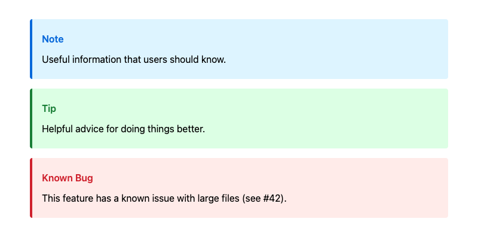
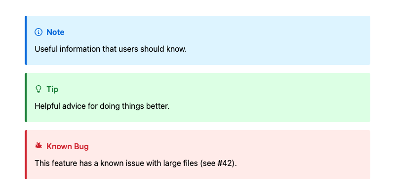

# commonmark-ext-gfm-alerts

Extension for [commonmark-java](https://github.com/commonmark/commonmark-java) that adds support for [GitHub Flavored Markdown alerts](https://docs.github.com/en/get-started/writing-on-github/getting-started-with-writing-and-formatting-on-github/basic-writing-and-formatting-syntax#alerts).

Enables highlighting important information using blockquote syntax with five standard alert types: NOTE, TIP, IMPORTANT, WARNING, and CAUTION.

## Usage

### Markdown Syntax

```markdown
> [!NOTE]
> Useful information

> [!WARNING]
> Critical information
```

### Standard GFM Types

```java
var extension = AlertsExtension.create();
var parser = Parser.builder().extensions(List.of(extension)).build();
var renderer = HtmlRenderer.builder().extensions(List.of(extension)).build();
```

### Custom Alert Types

Add custom types beyond the five standard GFM types:

```java
var extension = AlertsExtension.builder()
        .addCustomType("BUG", "Known Bug")
        .build();
```

Custom types must be UPPERCASE. Standard type titles can also be overridden for localization.

### Custom Alert Titles

Allow authors to provide custom titles per alert by adding text after the alert
marker on the same line:

```java
var extension = AlertsExtension.builder().allowCustomTitles().build();
```

```markdown
> [!NOTE] Keep in mind <!-- Overrides default title of "Note" -->
> Useful information

> [!WARNING] Be **very** careful <!-- Inline formatting is supported -->
> Critical information
```

### Nesting Alerts

By default, alerts cannot be nested within other blocks. Alerts within other
blocks are parsed as regular block quotes.

```markdown
<!-- Allowed -->
> [!NOTE]
> Useful information

<!-- Not allowed -->
- > [!NOTE]
  > Useful information
```

This behavior can be changed to allow nested alerts:

```java
var extension = AlertsExtension.builder().allowNestedAlerts().build();
```

### Styling

Alerts render as `<div>` elements with CSS classes:

```html
<div class="markdown-alert markdown-alert-note" data-alert-type="note">
  <p class="markdown-alert-title">Note</p>
  <p>Content</p>
</div>
```

Basic CSS example:

```css
.markdown-alert {
  padding: 0.5rem 1rem;
  margin-bottom: 1rem;
  border-left: 4px solid;
}

.markdown-alert-note { border-color: #0969da; background-color: #ddf4ff; }
.markdown-alert-tip { border-color: #1a7f37; background-color: #dcffe4; }
.markdown-alert-important { border-color: #8250df; background-color: #f6f0ff; }
.markdown-alert-warning { border-color: #9a6700; background-color: #fff8c5; }
.markdown-alert-caution { border-color: #cf222e; background-color: #ffebe9; }
```



Icons can be added using GitHub's [Octicons](https://primer.style/octicons/):



## License

See the main commonmark-java project for license information.
